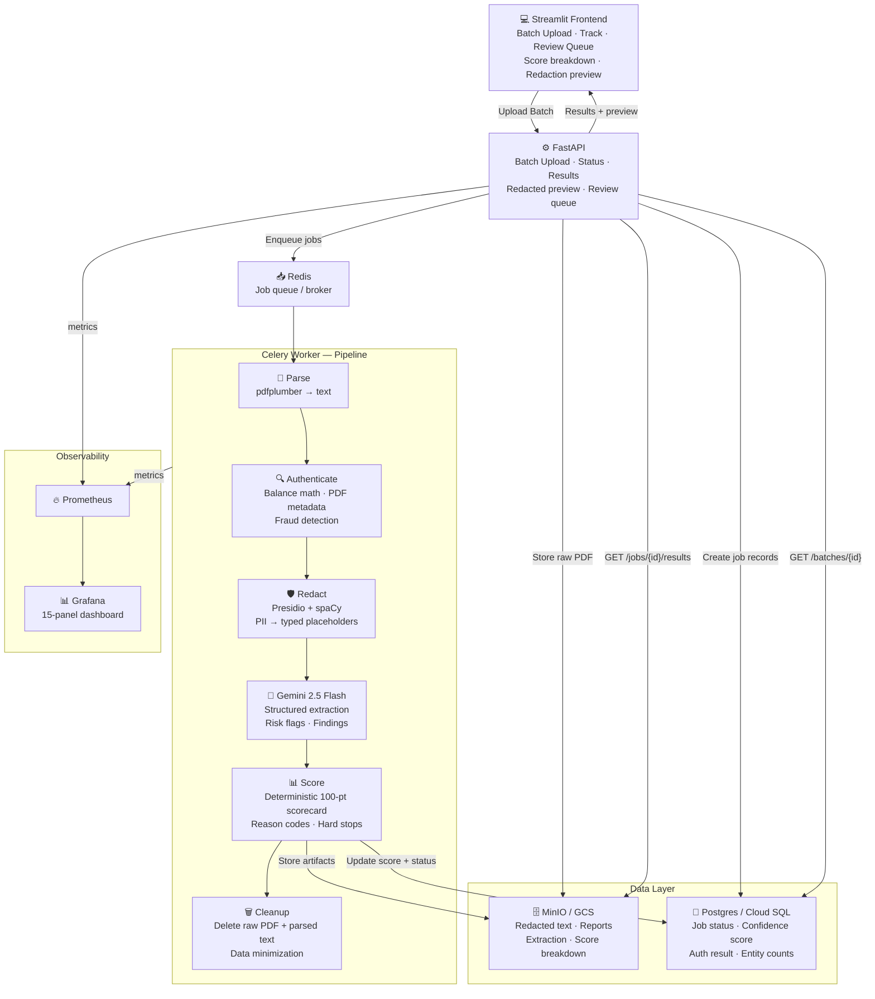

# SENTINEL — Scalable, ENabled, Trustworthy Infrastructure for Next-genAI Execution Layer

> **Industry partner:** Best Egg (fintech / personal loans) · Mike Urban, Chief Technology Operations Officer  
> **Course:** CISC 867010 — Pilot Research Software Engineering, University of Delaware (Spring 2026)  
> **Faculty sponsor:** Prof. Sunita Chandrasekaran

## What Best Egg Asked For

> *”Help define and create a scalable, resilient and secure GenAI infrastructure and orchestration layer [to integrate more unstructured data] … and do that in a scalable, resilient, and secure way.”*

Best Egg processes thousands of personal loan applications. Applicants submit unstructured financial documents, bank statements, paystubs, W-2s that must be reviewed before a lending decision. Today this is a slow, manual, human-in-the-loop process. GenAI can accelerate it, but Best Egg operates in a highly regulated industry: a reckless integration creates legal, compliance, and reputational risk.

**What they need is not just an LLM call. They need a framework**, an infrastructure layer that ingests raw documents, strips PII before anything reaches the model, extracts structured signals, and proves it did all of this correctly via a dashboard.

### Deliverables (from the brief)
1. **Framework** — the end-to-end pipeline (upload → parse → redact → extract → validate → store)
2. **Visualization dashboard** — proves the framework is delivering on scalability, resiliency, and security
3. **Infrastructure** — the actual running system, not just a prototype sketch

### Three properties that cannot be traded off
| Property | What it means in this system |
|---|---|
| **Scalable** | **Batch processing (multi-file upload)**, async job queue (Celery + Redis), horizontal workers, Prometheus throughput metrics |
| **Resilient** | Retries with backoff, dead-letter routing, idempotent pipeline steps, audit trail per step |
| **Secure** | PII never reaches the LLM (enforced by pipeline order, not discipline); safe logging; least privilege |

### What Sentinel produces (for downstream lending systems)
Each processed document generates:
- **Structured extraction** — income, account balances, recurring transactions, risk flags
- **Deterministic confidence score** — 100-point scorecard with reason codes (not “AI said 0.74”)
- **Audit trail** — redaction report, authenticity report, model + prompt version, artifact hashes
- **Review queue entry** (if flagged) — human reviewer sees *why*, not just a score

### Stakeholders
| Role | What they need from Sentinel |
|---|---|
| Underwriting / Ops | Fast structured outputs from raw documents, no manual reading |
| Risk & Compliance | Hard guarantee: LLM never sees raw PII; every decision has a traceable reason |
| Platform Engineering | Reliable async orchestration queues, retries, idempotency, failure visibility |
| ML/LLM Engineering | Controlled extraction schema-pinned, model + prompt versioned, output PII scan |
| Auditors | Full lineage per job: what ran, when, on what input, with what model/prompt version |
| Human Reviewers | Explainable flags (ECOA / GDPR right-to-explanation “AI said so” is not a reason) |

**Scope (MVP)**
- **PDF only**, digital bank statements, paystubs, W-2s
- End-to-end: upload → parse → redact → LLM extract → score → validate → store → observe

**Core guarantees**
- **Privacy:** LLM receives only redacted text — enforced by pipeline order, not discipline
- **Auditability:** evidence artifact for every step (timestamps, versions, artifact IDs)
- **Reliability:** job state machine, retries/backoff, idempotency, DLQ
- **Observability:** throughput/latency/failure metrics + security indicators (redaction counts, policy blocks)
- **Explainability:** every routing decision (PASS/NEEDS_REVIEW) backed by named reason codes

**Out of scope for MVP**
- OCR for scanned/image PDFs
- Email, chat, image ingestion

---

## Project Roadmap

### Phase 0 — MVP (target: end of current week)
Complete the core pipeline end-to-end on local Docker Compose. All checklist items above must be green before moving on.

Pipeline: `upload → parse → redact → LLM extract → validate → store → observe`

### Phase 1 — Presentable (target: following week)
Make the system demo-ready and visually inspectable.

- [x] **UI dashboard** — batch document upload, live job status polling, extracted structured output viewer, redaction diff (what got blacked out and why)
- [x] **Batch processing** — upload multiple files (e.g., bank statement + paystub) in a single application; track collective progress and individual results
- [x] **Grafana dashboards** — pre-configured panels for throughput, latency, redaction counts, failure rates, review queue depth
- [x] **Prompt + model versioning** — every LLM extraction job records model name, prompt version, and schema version in the audit trail
- [x] **Sample data** — anonymized demo bank statement PDFs for a self-contained demo flow
- [x] **Document relevance check** — after parsing, classify whether the document is financially relevant (bank statement, paystub) before passing it to redaction; irrelevant documents (flight tickets, receipts, etc.) are rejected early with a reason

### LLM Backend

The extraction step currently uses **Gemini 2.5 Flash** (Google AI API) via `src/api/app/extractor.py`. The LLM backend and the deployment platform are independent — swapping one does not require changing the other.

| Option | When to use | What changes |
|---|---|---|
| **Gemini Flash (Google AI API)** | Current — development and testing | `GOOGLE_API_KEY` in `.env`; `extractor.py` as-is |
| **Gemini on Vertex AI** | GCP deployment with university credits | Swap `extractor.py` to Vertex AI SDK; schema and prompt are identical |

The extraction schema, system prompt, PII scan, and audit trail are backend-agnostic. Moving from the Google AI API to Vertex AI (for GCP deployment) is a one-file change in `extractor.py`.

### Phase 2 — Cloud Deployment (GCP)
Migrate the dockerized local stack to GCP with minimal code changes.

| Local | GCP | Notes |
|---|---|---|
| MinIO | Cloud Storage (GCS) | Native GCS support added with fallback to MinIO |
| PostgreSQL (Docker) | Cloud SQL (PostgreSQL) | Swap `DATABASE_URL` |
| Redis (Docker) | Cloud Memorystore | Swap Redis URL |
| FastAPI + Worker | Cloud Run | Push image to Artifact Registry, deploy |

## Futuristic: Trusted RAG Chatbot (Phase 4+)

While out of scope for the current MVP, the Sentinel infrastructure is designed to support a **Private RAG (Retrieval-Augmented Generation) Chatbot**.

Instead of sending customer data to public LLM APIs, Sentinel would:
1.  **Ingest** the redacted and verified documents into a private Vector Database (e.g., pgvector on Cloud SQL).
2.  **Use a Private LLM:** Use a locally-hosted LLM or Vertex AI Model Garden to answer customer questions about their application.
3.  **Guarantee Trust:** Customers can interact with an AI that has "seen" their documents but has no access to their raw PII, ensuring that even a model hallucination or prompt injection cannot leak their sensitive data.

---

## Project Status

### Phase 0 — MVP (complete)
- [x] Repo initialized
- [x] API: upload PDF
- [x] Storage: raw PDF + metadata (MinIO + PostgreSQL)
- [x] Parse: extract text (pdfplumber)
- [x] Input guardrails (file type, size, magic bytes, document classification, PII dump detection)
- [x] PII detection + redaction (Presidio + spaCy `en_core_web_lg` ensemble)
- [x] Document authentication (deterministic fraud detection — type classification, balance math, PDF metadata)
- [x] LLM extraction (redacted text only — Gemini 2.5 Flash, schema-constrained, output PII scan)
- [x] Audit trail (redaction report, authenticity report, extraction metadata per job)
- [x] Dashboard (Prometheus + Grafana — 15-panel pipeline monitor)
- [x] Metadata persistence (confidence score, auth result, entity counts → PostgreSQL per job)
- [x] Validation + review state (confidence threshold → NEEDS_REVIEW routing; `review_status` field for human approval)
- [x] Review queue API (list NEEDS_REVIEW jobs, approve/reject endpoint)
- [x] Failure-by-step metrics (Grafana panel — which pipeline stage is breaking)

### Phase 1 — Frontend & Demo-ready
- [x] UI — batch document upload, live job status polling, extracted output viewer, redaction diff (`frontend/app.py`)
- [x] Review queue UI — reviewer sees **why** a document was flagged, score breakdown with reason codes, approve/reject with mandatory written reason
- [x] Document relevance check — post-parse keyword classifier rejects non-financial docs (receipts, leases, etc.) before any LLM call
- [x] Sample anonymized bank statement PDFs for a self-contained demo
- [x] Prompt + model versioning locked into audit trail per job
- [ ] Follow-Up (the info missing and need more to perform a confidence review)

### Phase 2 — Cloud Deployment (GCP)
- [x] MinIO → Cloud Storage (GCS) — native support added with fallback to MinIO
- [x] PostgreSQL → Cloud SQL — environment variable ready
- [x] Redis → Cloud Memorystore — environment variable ready
- [x] FastAPI + Celery → Cloud Run — Dockerfiles and deploy workflow ready
- [x] CI/CD to Cloud Run via GitHub Actions — implemented in `.github/workflows/deploy.yml`

### Phase 3 — Agentic Pipeline (Google ADK)
- [ ] ~~Document Evaluation Agent — relevance check before extraction~~ (SCRAPPED)
- [ ] ~~Credit Analysis Agent — gated behind evaluation, structured extraction~~ (SCRAPPED)
- [ ] ~~Orchestrator coordinating both agents~~ (SCRAPPED)

---

## Architecture

