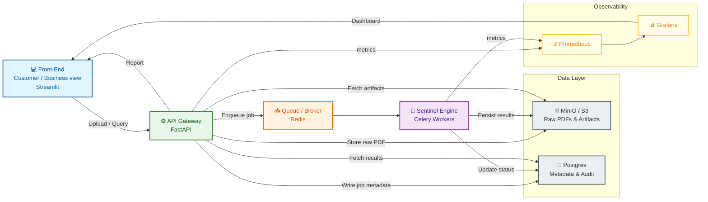

# Case Study: Sentinel — Next-Gen AI Execution Layer

## Overview
Financial institutions receive **PDF-based unstructured documents** (especially **bank statements** and paystubs). Manual review is slow and expensive, but “just run an LLM on it” is risky because these docs contain **PII/PCI**.

**Sentinel** is a workflow orchestration + policy enforcement layer that enables **safe AI extraction** by ensuring the LLM only ever sees **redacted** content, while producing **auditable evidence** and **observability signals** that prove the system is doing what it claims.

**Stakeholders**
- **Business / Underwriting / Ops:** wants fast structured outputs (not the whole raw document)
- **Risk & Compliance / Security:** needs hard guarantees (no raw PII to LLM, safe logging, least privilege)
- **Data/Platform Engineering:** needs reliable orchestration (queues, retries, idempotency, DLQ)
- **ML/LLM Engineers:** need a controlled extraction workflow (schema, prompt/model versioning)
- **Auditors:** need traceable lineage (what ran, when, on what input, with what model/prompt)

**MVP focus**
PDFs → **safe redaction** → **LLM-based structured extraction (redacted only)** → validation → **audit + dashboard**

### Key mappings
| Phrase | Technical understanding |
|---|---|
| “Sentinel layer” | Orchestration + policy enforcement layer |
| “AI checks documents” | LLM extraction workflow (schema-defined structured output) |
| “Hide sensitive data” | PII detection + redaction/tokenization step |
| “Make sure nothing leaks” | Egress controls + safe logging + least privilege |
| “Track what happened” | Audit trail (lineage: inputs/outputs/steps/models) |
| “Show it’s working” | Observability dashboard (metrics/logs/traces) |
| “Flag if something is off” | Validation + confidence thresholds + review queue |

**Scope (MVP)**
- **PDF only** (start with **digital bank statement PDFs**)
- End-to-end: upload → parse → redact → LLM extract → validate → store → observe

**Core guarantees**
- **Privacy guarantee:** LLM receives **only redacted text** (never raw PII)
- **Auditability:** evidence for every step (timestamps, versions, artifact hashes/IDs)
- **Reliability:** job state, retries/backoff, idempotency, DLQ
- **Observability:** throughput/latency/failures + security indicators (redaction counts, policy blocks)

**Beyond MVP (explicitly out of scope for the first demo)**
- OCR for scanned PDFs
- Email/chat/image ingestion
- Multi-tenant governance + enterprise RBAC
- Policy engine (e.g., OPA), tokenization vault, stronger prompt-injection defenses

---

## Project Roadmap

### Phase 0 — MVP (target: end of current week)
Complete the core pipeline end-to-end on local Docker Compose. All checklist items above must be green before moving on.

Pipeline: `upload → parse → redact → LLM extract → validate → store → observe`

### Phase 1 — Presentable (target: following week)
Make the system demo-ready and visually inspectable.

- **UI dashboard** — document upload, live job status polling, extracted structured output viewer, redaction diff (what got blacked out and why)
- **Grafana dashboards** — pre-configured panels for throughput, latency, redaction counts, failure rates, review queue depth
- **Prompt + model versioning** — every LLM extraction job records model name, prompt version, and schema version in the audit trail
- **Sample data** — anonymized demo bank statement PDFs for a self-contained demo flow
- **Document relevance check** — after parsing, classify whether the document is financially relevant (bank statement, paystub) before passing it to redaction; irrelevant documents (flight tickets, receipts, etc.) are rejected early with a reason; batch uploads surface per-file accept/reject results to the user

### Phase 2 — Cloud Deployment (GCP)
Migrate the dockerized local stack to GCP with minimal code changes.

| Local | GCP | Notes |
|---|---|---|
| MinIO | Cloud Storage (GCS) | S3-compatible endpoint, swap env var only |
| PostgreSQL (Docker) | Cloud SQL (PostgreSQL) | Swap `DATABASE_URL` |
| Redis (Docker) | Cloud Memorystore | Swap Redis URL |
| FastAPI + Worker | Cloud Run | Push image to Artifact Registry, deploy |

### Phase 3 — Databricks Integration
Introduce Databricks for the audit trail, analytics, and model governance layers.

- **Delta Lake** — replace (or mirror) PostgreSQL audit events with append-only Delta tables; immutable by design, regulators love it
- **MLflow** (built into Databricks) — prompt versioning, model tracking, extraction confidence metrics over time
- **Databricks SQL** — analytics dashboard across all jobs: accuracy trends, redaction patterns, model drift
- **Unity Catalog** — data governance and lineage for the extracted structured outputs

> Databricks runs natively on GCP, so Phase 2 and Phase 3 coexist in the same cloud.

**Project status**
- [x] Repo initialized
- [x] API: upload PDF
- [x] Storage: raw PDF + metadata
- [x] Parse: extract text
- [x] PII detection + redaction
- [ ] LLM extraction (redacted text only)
- [ ] Validation + review state
- [ ] Audit trail
- [ ] Dashboard (Prometheus + Grafana)

---

## Repository Structure
...

---

## Getting Started
1. Clone the repository
2. Create a feature branch
3. Open a pull request early

---

## Documentation
This repository includes an optional Sphinx documentation scaffold.

- Architecture & dataflow (pipeline diagram + artifacts per step)
- Security model (what is never logged, what the LLM never sees, egress controls)
- Audit model (event schema + lineage fields + artifact hashing)
- Validation rules (what triggers `NEEDS_REVIEW`)
- Observability (exact metrics emitted and what “good” looks like)

---

## Contributing
All changes must go through pull requests.
- LLM input must be redacted-only (enforced by pipeline, not discipline)
- Idempotency (retries must not duplicate artifacts/results)
- Audit events for every step (start/end + success/failure + versions + artifact IDs)
