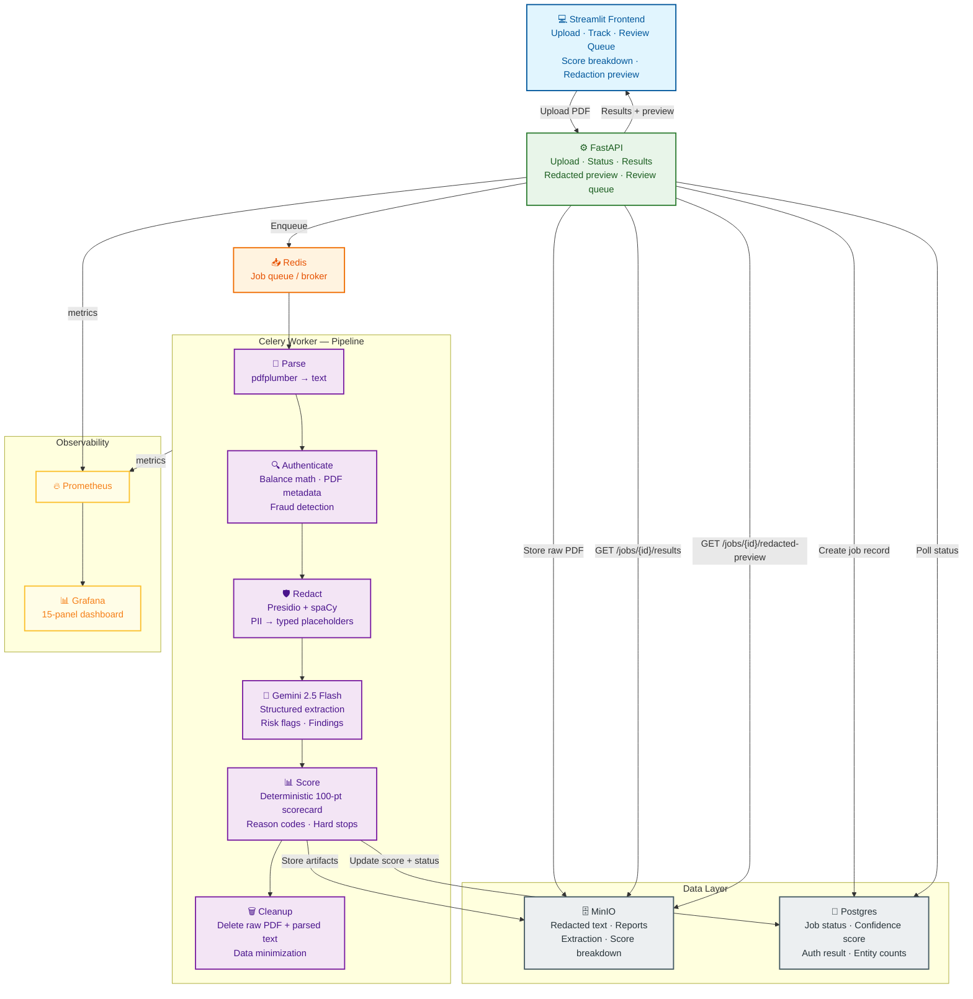

# SENTINEL — Scalable, ENabled, Trustworthy Infrastructure for Next-genAI Execution Layer

> **Industry partner:** Best Egg (fintech / personal loans) · Mike Urban, Chief Technology Operations Officer  
> **Course:** CISC 867010 — Pilot Research Software Engineering, University of Delaware (Spring 2026)  
> **Faculty sponsor:** Prof. Sunita Chandrasekaran

## What Best Egg Asked For

> *”Help define and create a scalable, resilient and secure GenAI infrastructure and orchestration layer [to integrate more unstructured data] … and do that in a scalable, resilient, and secure way.”*

Best Egg processes thousands of personal loan applications. Applicants submit unstructured financial documents — bank statements, paystubs, W-2s — that must be reviewed before a lending decision. Today this is a slow, manual, human-in-the-loop process. GenAI can accelerate it, but Best Egg operates in a highly regulated industry: a reckless integration creates legal, compliance, and reputational risk.

**What they need is not just an LLM call. They need a framework** — an infrastructure layer that ingests raw documents, strips PII before anything reaches the model, extracts structured signals, and proves it did all of this correctly via a dashboard.

### Deliverables (from the brief)
1. **Framework** — the end-to-end pipeline (upload → parse → redact → extract → validate → store)
2. **Visualization dashboard** — proves the framework is delivering on scalability, resiliency, and security
3. **Infrastructure** — the actual running system, not just a prototype sketch

### Three properties that cannot be traded off
| Property | What it means in this system |
|---|---|
| **Scalable** | Async job queue (Celery + Redis), horizontal workers, Prometheus throughput metrics |
| **Resilient** | Retries with backoff, dead-letter routing, idempotent pipeline steps, audit trail per step |
| **Secure** | PII never reaches the LLM (enforced by pipeline order, not discipline); safe logging; least privilege |

### What Sentinel produces (for downstream lending systems)
Each processed document generates:
- **Structured extraction** — income, account balances, recurring transactions, risk flags
- **Deterministic confidence score** — 100-point scorecard with reason codes (not “AI said 0.74”)
- **Audit trail** — redaction report, authenticity report, model + prompt version, artifact hashes
- **Review queue entry** (if flagged) — human reviewer sees *why*, not just a score

### Stakeholders
| Role | What they need from Sentinel |
|---|---|
| Underwriting / Ops | Fast structured outputs from raw documents — no manual reading |
| Risk & Compliance | Hard guarantee: LLM never sees raw PII; every decision has a traceable reason |
| Platform Engineering | Reliable async orchestration — queues, retries, idempotency, failure visibility |
| ML/LLM Engineering | Controlled extraction — schema-pinned, model + prompt versioned, output PII scan |
| Auditors | Full lineage per job: what ran, when, on what input, with what model/prompt version |
| Human Reviewers | Explainable flags (ECOA / GDPR right-to-explanation — “AI said so” is not a reason) |

**Scope (MVP)**
- **PDF only** — digital bank statements, paystubs, W-2s
- End-to-end: upload → parse → redact → LLM extract → score → validate → store → observe

**Core guarantees**
- **Privacy:** LLM receives only redacted text — enforced by pipeline order, not discipline
- **Auditability:** evidence artifact for every step (timestamps, versions, artifact IDs)
- **Reliability:** job state machine, retries/backoff, idempotency, DLQ
- **Observability:** throughput/latency/failure metrics + security indicators (redaction counts, policy blocks)
- **Explainability:** every routing decision (PASS/NEEDS_REVIEW) backed by named reason codes

**Out of scope for MVP**
- OCR for scanned/image PDFs
- Email, chat, image ingestion
- Multi-tenant RBAC / enterprise policy engine (OPA)
- Tokenization vault, stronger prompt-injection defenses

---

## Project Roadmap

### Phase 0 — MVP (target: end of current week)
Complete the core pipeline end-to-end on local Docker Compose. All checklist items above must be green before moving on.

Pipeline: `upload → parse → redact → LLM extract → validate → store → observe`

### Phase 1 — Presentable (target: following week)
Make the system demo-ready and visually inspectable.

- **UI dashboard** — document upload, live job status polling, extracted structured output viewer, redaction diff (what got blacked out and why)
- **Grafana dashboards** — pre-configured panels for throughput, latency, redaction counts, failure rates, review queue depth
- **Prompt + model versioning** — every LLM extraction job records model name, prompt version, and schema version in the audit trail
- **Sample data** — anonymized demo bank statement PDFs for a self-contained demo flow
- **Document relevance check** — after parsing, classify whether the document is financially relevant (bank statement, paystub) before passing it to redaction; irrelevant documents (flight tickets, receipts, etc.) are rejected early with a reason; batch uploads surface per-file accept/reject results to the user

### LLM Backend

The extraction step currently uses **Gemini 2.5 Flash** (Google AI API) via `src/api/app/extractor.py`. The LLM backend and the deployment platform are independent — swapping one does not require changing the other.

| Option | When to use | What changes |
|---|---|---|
| **Gemini Flash (Google AI API)** | Current — development and testing | `GOOGLE_API_KEY` in `.env`; `extractor.py` as-is |
| **Gemini on Vertex AI** | GCP deployment with university credits | Swap `extractor.py` to Vertex AI SDK; schema and prompt are identical |

The extraction schema, system prompt, PII scan, and audit trail are backend-agnostic. Moving from the Google AI API to Vertex AI (for GCP deployment) is a one-file change in `extractor.py`.

### Phase 2 — Cloud Deployment (GCP)
Migrate the dockerized local stack to GCP with minimal code changes.

| Local | GCP | Notes |
|---|---|---|
| MinIO | Cloud Storage (GCS) | S3-compatible endpoint, swap env var only |
| PostgreSQL (Docker) | Cloud SQL (PostgreSQL) | Swap `DATABASE_URL` |
| Redis (Docker) | Cloud Memorystore | Swap Redis URL |
| FastAPI + Worker | Cloud Run | Push image to Artifact Registry, deploy |

## LLM Extraction & Agentic Phase

The next phase of the pipeline introduces LLM-based extraction — but the core guarantee does not change. The LLM only ever receives redacted text. Redaction always runs first. This is enforced by the pipeline, not by trust.

**Step 1 — Single LLM extraction (foundation)**

The first implementation is a single extraction step. After redaction completes, the Celery worker picks up the redacted text, sends it to an LLM with a structured prompt, and returns a risk profile: income, account balances, recurring transactions, overdraft flags. This output is schema-defined and versioned. The model name and prompt version are recorded in the audit trail alongside the redacted artifact that was used as input.

**Step 2 — Multi-agent architecture with Google ADK**

The single-step extraction evolves into a two-agent pipeline orchestrated via Google Agent Development Kit (ADK):

- **Document Evaluation Agent** — runs first. Performs a relevance check on the parsed and redacted text to determine whether the document is actually a financial document (bank statement, paystub). This catches documents that cleared the Level 1 input guardrails — valid PDFs with financial keywords — but aren't genuinely relevant at a semantic level, like a restaurant bill or a lease agreement. Documents that fail relevance are rejected here with a reason, before any extraction attempt.
- **Credit Analysis Agent** — runs only if the Document Evaluation Agent passes the file. Takes the redacted text and performs structured extraction: income verification, balance trends, risk classification, and anomaly flags.

An orchestrator coordinates both agents. Evaluation always runs first; credit analysis is gated behind it. Neither agent receives anything other than redacted text.

**Why this matters at scale**

This architecture is designed for batch processing — think thousands of customer loan applications processed overnight, each file moving through the same guaranteed pipeline with no human reading a single raw document. The agents operate in parallel across a worker pool, the audit trail captures every step, and the entire run is observable via the metrics layer.

---

## Project Status

### Phase 0 — MVP (complete)
- [x] Repo initialized
- [x] API: upload PDF
- [x] Storage: raw PDF + metadata (MinIO + PostgreSQL)
- [x] Parse: extract text (pdfplumber)
- [x] Input guardrails (file type, size, magic bytes, document classification, PII dump detection)
- [x] PII detection + redaction (Presidio + spaCy `en_core_web_lg` ensemble)
- [x] Document authentication (deterministic fraud detection — type classification, balance math, PDF metadata)
- [x] LLM extraction (redacted text only — Gemini 2.5 Flash, schema-constrained, output PII scan)
- [x] Audit trail (redaction report, authenticity report, extraction metadata per job)
- [x] Dashboard (Prometheus + Grafana — 15-panel pipeline monitor)
- [x] Metadata persistence (confidence score, auth result, entity counts → PostgreSQL per job)
- [x] Validation + review state (confidence threshold → NEEDS_REVIEW routing; `review_status` field for human approval)
- [x] Review queue API (list NEEDS_REVIEW jobs, approve/reject endpoint)
- [x] Failure-by-step metrics (Grafana panel — which pipeline stage is breaking)

### Phase 1 — Frontend & Demo-ready
- [x] UI — document upload, live job status polling, extracted output viewer, redaction diff (`frontend/app.py`)
- [x] Review queue UI — reviewer sees **why** a document was flagged, score breakdown with reason codes, approve/reject with mandatory written reason
- [x] Document relevance check — post-parse keyword classifier rejects non-financial docs (receipts, leases, etc.) before any LLM call
- [ ] Sample anonymized bank statement PDFs for a self-contained demo
- [ ] Prompt + model versioning locked into audit trail per job

#### Explainability requirement (right to explanation)

Laws like **ECOA** (US fair lending) and **GDPR Article 22** (EU) require that automated decisions affecting people — like flagging or rejecting a loan application — come with a **specific, human-readable reason**. "The AI gave it a 0.74" is not a reason. It is not legally defensible and it is not fair to the person being reviewed.

**What the review queue UI must show (not just the confidence score):**

| Signal | Where it comes from | What it tells the reviewer |
|---|---|---|
| `risk_flags.overdraft_occurrences` | Gemini, grounded in document | How many overdrafts were observed |
| `risk_flags.nsf_fee_occurrences` | Gemini, grounded in document | Non-sufficient funds events |
| `risk_flags.document_integrity_flag` | Gemini math check | Document figures are self-contradictory |
| `risk_flags.notes` | Gemini free-text | Plain English explanation of any flags |
| `authentic` + `auth_confidence` | Authenticator (deterministic) | Balance math, PDF metadata checks |
| `confidence_score` | Gemini self-report | Summary indicator only — never the sole reason shown |

The confidence score is a **routing signal** (below 0.80 → human review). It is not an explanation. The `risk_flags` and `notes` fields are the explanation. The UI must surface both.

### Phase 2 — Cloud Deployment (GCP)
- [ ] MinIO → Cloud Storage (GCS) — s3-compatible, swap env var only
- [ ] PostgreSQL → Cloud SQL — swap `DATABASE_URL`
- [ ] Redis → Cloud Memorystore — swap Redis URL
- [ ] FastAPI + Celery → Cloud Run — push image to Artifact Registry, deploy
- [ ] CI/CD to Cloud Run via GitHub Actions

### Phase 3 — Agentic Pipeline (Google ADK)
- [ ] Document Evaluation Agent — relevance check before extraction
- [ ] Credit Analysis Agent — gated behind evaluation, structured extraction
- [ ] Orchestrator coordinating both agents

---

## Architecture

---

## Getting Started
1. Clone the repository
2. Create a feature branch
3. Open a pull request early

---

## Documentation
This repository includes an optional Sphinx documentation scaffold.

- Architecture & dataflow (pipeline diagram + artifacts per step)
- Security model (what is never logged, what the LLM never sees, egress controls)
- Audit model (event schema + lineage fields + artifact hashing)
- Validation rules (what triggers `NEEDS_REVIEW`)
- Observability (exact metrics emitted and what “good” looks like)

---

## Contributing
All changes must go through pull requests.
- LLM input must be redacted-only (enforced by pipeline, not discipline)
- Idempotency (retries must not duplicate artifacts/results)
- Audit events for every step (start/end + success/failure + versions + artifact IDs)
